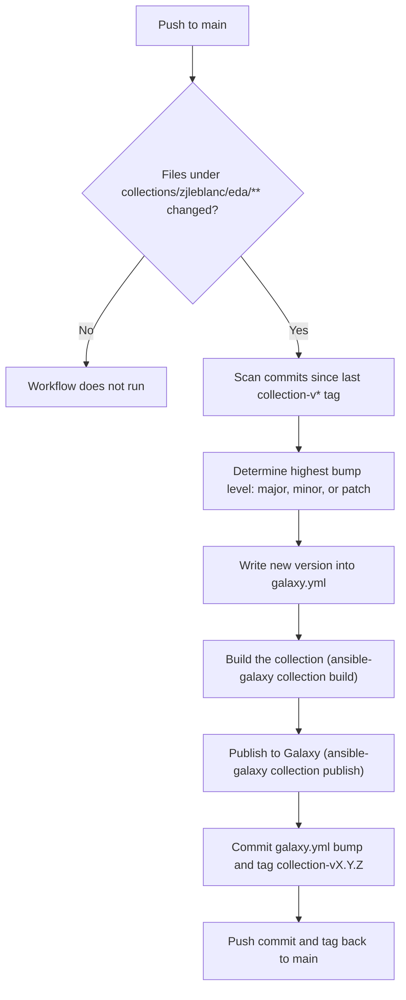

# Collection Release Pipeline

This repository automatically versions and publishes the
[`zjleblanc.eda`](../collections/zjleblanc/eda) Ansible collection to
[Ansible Galaxy](https://galaxy.ansible.com/) whenever a change is pushed to
`main` under `collections/zjleblanc/eda/`.

The workflow lives at
[`.github/workflows/collection-release.yml`](../.github/workflows/collection-release.yml)
and its version-bump logic lives at
[`.github/scripts/bump_collection_version.py`](../.github/scripts/bump_collection_version.py).

## How it works



1. **Trigger** -- the workflow only runs on pushes to `main` that touch files
   under `collections/zjleblanc/eda/`. Changes elsewhere in the repo
   (playbooks, rulebooks, other docs, etc.) never trigger a release.
2. **Determine the bump level** -- the pipeline finds the most recent
   `collection-v*` tag, then inspects every commit since that tag that
   touched the collection path. Each commit's message prefix maps to a bump
   level (see below). If several qualifying commits are included in the
   push, the **highest** level wins (major > minor > patch).
3. **Bump `galaxy.yml`** -- the new version is computed from the current
   `version:` field in
   [`galaxy.yml`](../collections/zjleblanc/eda/galaxy.yml) and written back
   in place, before anything is built or published.
4. **Build** -- `ansible-galaxy collection build` packages the collection
   into a `.tar.gz` using the already-bumped version.
5. **Publish** -- `ansible-galaxy collection publish` uploads that tarball to
   Ansible Galaxy using the `GALAXY_API_TOKEN` repository secret.
6. **Commit and tag** -- once the publish succeeds, the pipeline commits the
   updated `galaxy.yml` back to `main` (with `[skip ci]` in the message so
   it doesn't re-trigger itself) and creates a `collection-vX.Y.Z` tag
   pointing at that commit.

Because the version is bumped **before** building and publishing, the
version committed to the repository always matches the version published to
Galaxy -- there is no drift between the two.

## Commit message convention

The bump level is determined by the prefix of each qualifying commit's
subject line:

| Prefix | Bump level | Example |
| --- | --- | --- |
| `major: ...` | major (`X+1.0.0`) | `major: redesign dd_poll plugin interface` |
| `minor: ...` | minor (`X.Y+1.0`) | `minor: add support for Datadog v2 bearer auth` |
| `patch: ...` | patch (`X.Y.Z+1`) | `patch: fix retry backoff in dd_poll` |
| `feat: ...` | minor (alias of `minor:`) | `feat: add new polling interval option` |
| `fix: ...` | patch (alias of `patch:`) | `fix: handle 429 responses from Datadog API` |
| *(anything else)* | patch (safe default) | `update dd_poll docstring` |

Only commits that modify files under `collections/zjleblanc/eda/` are
considered -- commits that only touch rulebooks, playbooks, or other docs
are ignored by the version-bump logic even if they're part of the same push.

### Examples

```
patch: fix pagination bug in dd_poll event source
minor: add configurable poll interval to dd_poll
major: drop support for Datadog v1 API key auth
feat: expose dedupe window as a plugin option
fix: correct SAT bearer header casing
```

## Required GitHub secret

The pipeline publishes to Galaxy using a repository secret named
`GALAXY_API_TOKEN`. To set it up:

1. Get an API token from your
   [Ansible Galaxy preferences page](https://galaxy.ansible.com/me/preferences).
2. In GitHub, go to the repository's **Settings -> Secrets and variables ->
   Actions**.
3. Click **New repository secret**.
4. Name: `GALAXY_API_TOKEN`
5. Value: paste the token from step 1.

No other secrets are required -- the commit/tag push step uses the default
`GITHUB_TOKEN` provided to the workflow (granted via `permissions: contents:
write` in the workflow file).

## Manually triggering or overriding a release

The workflow only runs on `push` to `main`, so to publish a new version:

1. Make your change(s) under `collections/zjleblanc/eda/`.
2. Use a commit message with the appropriate prefix (`major:`, `minor:`,
   `patch:`, `feat:`, or `fix:`).
3. Push (or merge a PR) to `main`.

If you need to skip a release for a given push entirely (for example, a
docs-only change inside the collection directory that shouldn't publish a
new version), include `[skip ci]` anywhere in the commit message -- the
workflow checks for this marker and will not run.

If the pipeline fails after publishing to Galaxy but before it can commit
and tag (for example, a push race with another workflow run), re-run the
**Commit and tag** step manually or push a follow-up commit. The next
successful run will reconcile `galaxy.yml` with whatever was last published,
since the bump is always computed from the current `version:` field.
