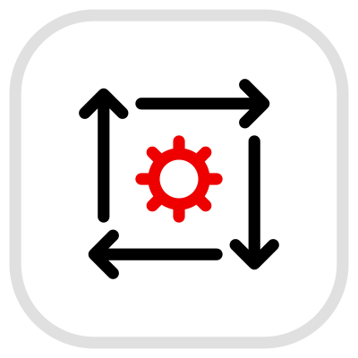
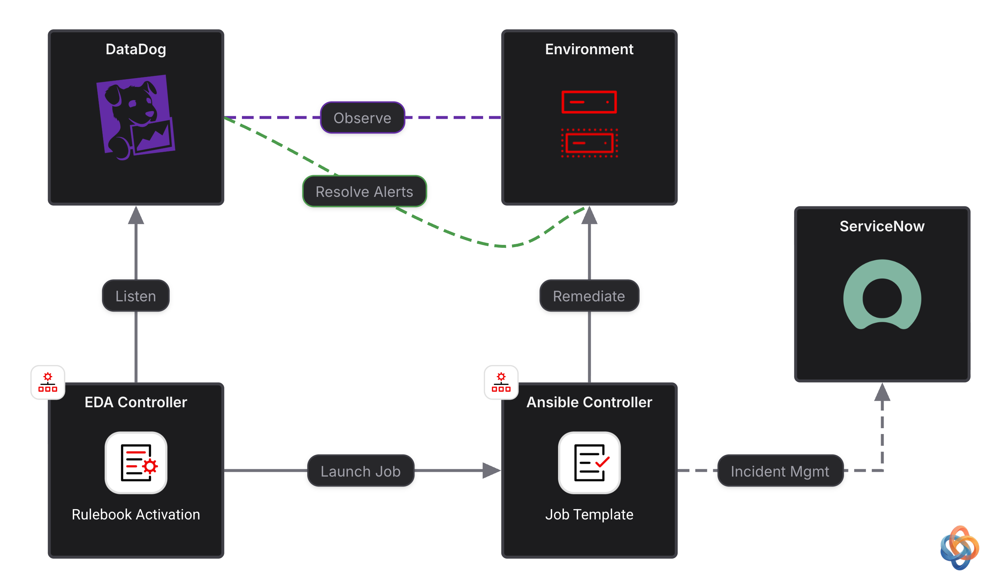
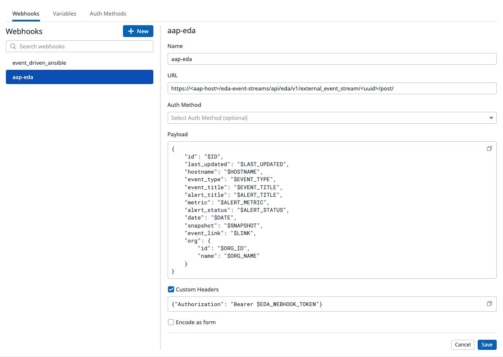
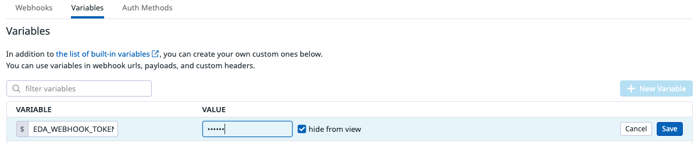
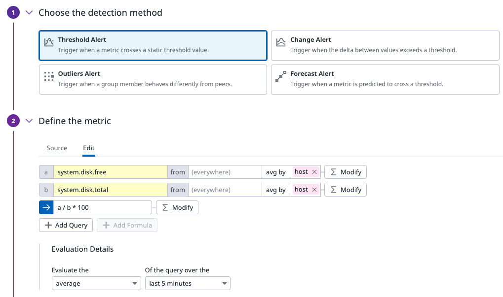
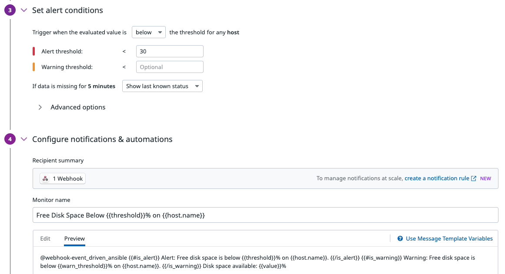

# Integrating Datadog with Event-Driven Ansible

<p align="center">
  
  <picture>
    <source media="(prefers-color-scheme: dark)" srcset=".attachments/arrow-dark.svg">
    
  </picture>
  
</p>

Datadog's Agent can monitor virtually anything on a host — disk space, CPU, memory, running processes, logs, APM traces, network checks, security signals — and raise a Monitor alert the moment a threshold is crossed. This guide shows how to wire those alerts into **Event-Driven Ansible (EDA)** so that any Datadog-observed condition can trigger an automated remediation workflow in Ansible Automation Platform (AAP), with an optional audit trail in a ticketing system like ServiceNow.

The worked example uses the same **free disk space** scenario as the [Dynatrace disk-space lab](expand_disk_space.md), but the pattern generalizes to anything the Datadog Agent can check. See [Extending to other Datadog monitors](#extending-to-other-datadog-monitors) below.

For background on why Red Hat recommends this pattern, see the blog post [Automate actions from Datadog observability data](https://www.redhat.com/en/blog/automate-actions-datadog-observability-data).

### Source Code

- [Rulebook](../rulebooks/datadog_event_stream.yml)

The workflow and job templates associated with the remediation are in two external repositories:
- [Configuration-as-Code](https://github.com/zjleblanc/ansible-cac/tree/main/config/aiops)
- [Ansible Playbooks](https://github.com/zjleblanc/ansible-cloud-mgmt/tree/master/playbooks)

## End-to-end flow

1. The **Datadog Agent** runs on a monitored host and continuously reports metrics/logs/traces to Datadog.
2. A **Datadog Monitor** evaluates those metrics against a threshold (for example, disk space below 30%) and transitions to an **Alert** state.
3. The monitor's notification message includes a **webhook handle** (`@webhook-<name>`), which causes Datadog to `POST` a JSON payload to the configured webhook URL — in this case, an AAP **event stream**.
4. **Event-Driven Ansible** receives the payload as an event. The rulebook in [`rulebooks/datadog_event_stream.yml`](../rulebooks/datadog_event_stream.yml) evaluates its rules' conditions against `event.payload`.
5. When a condition matches, the rule's action launches an AAP **job template** or **workflow template** to remediate the issue — optionally creating/updating a ServiceNow incident along the way, and closing the loop once resolved.



## Tech Stack

- Datadog (Agent + Monitors + Webhooks integration)
- Ansible Automation Platform Controller
- Event-Driven Ansible Controller
- Optional: ServiceNow, AWS, or whatever infrastructure the remediation playbook targets

## Setup

### Install and configure the Datadog Agent

Install the [Datadog Agent](https://docs.datadoghq.com/agent/) on each host you want to monitor. Any integration the Agent supports (disk, CPU, memory, process, network, log collection, APM, etc.) can ultimately drive an EDA remediation — the Agent doesn't need any special configuration for this integration beyond what a normal Datadog check requires.

### Configure the Webhooks integration

Datadog delivers alerts to EDA the same way it delivers any other notification: through the [Webhooks integration](https://docs.datadoghq.com/integrations/webhooks/). Set this up **before** creating the monitor, since the monitor's notification will reference the webhook by name.

1. In Datadog, go to **Integrations > Webhooks** and click **New**.
2. Give it a name, e.g. `aap-eda`. This is what you'll reference as `@webhook-aap-eda` in monitor notifications.
3. **URL**: the POST URL of the AAP **event stream** you create further below (e.g. `https://<aap-host>/eda-event-streams/api/eda/v1/external_event_stream/<uuid>/post/`).
4. **Custom headers**: add `Content-Type: application/json` and `Authorization: Bearer <event-stream-token>` if the event stream requires an auth header.
5. **Payload**: leave the default Datadog payload template, or customize it — just make sure `alert_title`, `hostname`, and `event_link` (or whatever fields your rules key off) are present. The default template includes all three.




### Create a Datadog Monitor

In the Datadog portal, navigate to **Monitors > New Monitor** and choose the monitor type that matches what you want to observe (Metric, APM, Log, Process, etc.). For the disk-space example used by this repo's rulebook, create a **Metric Monitor**:

| Config | Value |
| --- | --- |
| Monitor type | Metric |
| Detection method | Threshold Alert |
| Define the Metric > Source | `avg:system.disk.free{*} by {host} / avg:system.disk.total{*} by {host} * 100` |
| Define the Metric > Evaluation Details | Evaluate the `average` of the query over the `last 5 minutes` |
| Data source scope | Filter to the host(s) or tags of interest |
| Set alert conditions > Alert threshold | `< 30` e.g. (below 30% free) |
| Configure notifications & automations > Recipient summary | `@webhook-aap-eda` (select the Webhook you created) |
| Configure notifications & automations > Monitor name | **Free Disk Space Below 30%** |

⚠️ **Monitor name** is important — the rulebook's condition matches on `event.payload.alert_title`. If you change the title, update the condition in the rulebook to match.

In the monitor's notification message, add `@webhook-aap-eda` on its own line so Datadog fires the webhook whenever the monitor triggers (and, optionally, when it recovers):

```text
@webhook-event_driven_ansible 
{{#is_alert}} Alert: Free disk space is below {{threshold}}% on {{host.name}}. {{/is_alert}}
{{#is_warning}} Warning: Free disk space is below {{warn_threshold}}% on {{host.name}}. {{/is_warning}}
Disk space available: {{value}}%
```

Key payload fields the rulebook consumes from Datadog's webhook body:

| Field | Used for |
| --- | --- |
| `event.payload.alert_title` | Matching the rule condition (`is match("Free Disk Space Below", ...)`) |
| `event.payload.hostname` | Throttle grouping and the `_host` extra var passed to the remediation workflow |
| `event.payload.event_link` | Included in the ServiceNow incident description/comments as a link back to the Datadog event |




### EDA Event Stream

Create an **external event stream** in the EDA controller (Automation Decisions / EDA UI): navigate to **Event Streams > Create Event Stream**, choose an appropriate credential type (Basic, Token, HMAC, etc. — matching whatever you configured in the Datadog webhook headers), and copy the generated **POST URL** into the Datadog webhook integration from the previous step. See the README's [What are event streams?](../README.md#what-are-event-streams) section for more background on this AAP 2.5+ pattern.

### EDA Decision Environment

Unlike Dynatrace, Datadog integration via event streams does **not** require a vendor-specific EDA collection. The raw webhook payload lands directly at `event.payload`, so the default/built-in decision environment (with `ansible.eda.webhook` available for local testing) is sufficient — no custom decision environment build is required just for Datadog.

### EDA Project

Point an AAP **Project** at this git repository (or your fork) so the rulebook is available to activations.

| Config | Value |
| --- | --- |
| Name | EDA Demos Project |
| SCM type | Git |
| SCM URL | https://github.com/zjleblanc/ansible-eda-demos.git |
| Credential | _Not required for public repo_ |
| Verify SSL | _Checked_ |

### EDA Rulebook Activation

Navigate to **Rulebook Activations > Create rulebook activation**:

| Config | Value |
| --- | --- |
| Name | Datadog Event Stream |
| Project | EDA Demos Project |
| Rulebook | `datadog_event_stream.yml` |
| Decision environment | Default (or your custom DE) |
| Event streams | Map **DataDog Event Source** to the event stream created above |
| Controller token | Token |
| Restart policy | On failure |
| Rulebook activation enabled? | _Checked_ |

### AAP Resources

The rulebook launches the same downstream automation described in the [disk space remediation lab](expand_disk_space.md#the-workflow) — a workflow with steps for creating a ServiceNow incident, resizing storage, and updating the incident. Reuse that workflow (`EDA // Remediation Workflow // Disk Space`) and its credentials/inventory rather than duplicating them; only the **event source** differs between the Dynatrace and Datadog demos, not the remediation.

For quick smoke-testing of an activation without a real alert, the rulebook also includes a catch-all job template launch (`EDA // No-Op`) that dumps `ansible_eda` variables — useful to confirm events are flowing before wiring up a real remediation workflow.

## The rulebook explained

[`rulebooks/datadog_event_stream.yml`](../rulebooks/datadog_event_stream.yml):

```1:11:rulebooks/datadog_event_stream.yml
### Preferred method for AAP 2.5+ ###
---
- name: Integrate with DataDog Workflow for Event-Driven Ansible
  hosts: all

  sources:
    # will be replaced by Event Stream
    - name: DataDog Event Source
      ansible.eda.webhook:
        host: 0.0.0.0
        port: 5010
```

The `sources` entry is a **placeholder**. It lets you run the rulebook locally with `ansible-rulebook` for testing, but when activated in AAP it gets swapped out for the event stream mapped in the activation — the rules below are unaffected either way.

```13:39:rulebooks/datadog_event_stream.yml
  rules:
    # Commands to generate mock disk consumption
    # (linux)    fallocate -l 4G dummy.img
    # (windows)  $file = [System.IO.File]::Create("C:\users\ec2-user\dummylarge.txt"); $file.SetLength(10GB); $file.Close();
    - name: Launch Free Disk Space Remediation
      condition: event.payload.alert_title is match("Free Disk Space Below", ignorecase=true)
      throttle:
        once_within: 30 minutes
        group_by_attributes:
          - event.payload['hostname']
      action:
        run_workflow_template:
          name: EDA // Remediation Workflow // Disk Space
          organization: Autodotes
          job_args:
            extra_vars:
              _host: "{{ event.payload['hostname'] }}"
              _aws_region: "us-east-2"
              inc_short_description: "{{ event.payload['alert_title'] }} [{{ event.payload['hostname'] }}]"
              inc_description: "Auto-generated event by Ansible for DataDog alert {{ event.payload['event_link'] }}"
              inc_other:
                comments: >
                  [code] <p>
                    <a href="{{ event.payload['event_link'] }}">
                      View Event Details
                    </a>
                  </p> [/code]
```

**Launch Free Disk Space Remediation** matches any alert whose title contains "Free Disk Space Below" (case-insensitive, so it matches both the 30% threshold example above and variations). It's **throttled** to fire at most once every 30 minutes per hostname — important because Datadog Monitors can re-notify repeatedly while a metric stays in the alert state, and you don't want to launch the remediation workflow on every re-notification. The workflow receives the affected host, region, and pre-formatted ServiceNow incident fields (short description, description, and an HTML comment linking back to the Datadog event) as extra vars.

```41:49:rulebooks/datadog_event_stream.yml
    - name: Launch Demo Job
      condition: true
      action:
        run_job_template:
          name: EDA // No-Op
          organization: Autodotes
          job_args:
            extra_vars:
              _hosts: localhost
```

**Launch Demo Job** is a catch-all (`condition: true`) that matches every event and runs a no-op job template. It's handy while first wiring up the event stream — deliberately noisy so you can confirm events are reaching the activation before you start layering on real remediation rules.

## Extending to other Datadog monitors

The disk-space rule is one instance of a general pattern: **any Datadog Monitor can drive any Ansible remediation**, as long as you can express "did this alert fire?" as a condition on `event.payload` and you have (or write) a playbook/workflow to fix it. Some other monitors you could add to this rulebook the same way:

| Datadog monitor type | Example alert title | Example remediation |
| --- | --- | --- |
| CPU / Memory (Metric) | "High memory usage" | Kill runaway processes, scale the instance, restart the service (see [`playbooks/remediate_memory_usage.yml`](../playbooks/remediate_memory_usage.yml)) |
| Process check | "Agent process down" | Restart the process/service via a job template |
| APM (latency/error rate) | "Elevated error rate on checkout-service" | Roll back a deployment, restart a pod/container, scale out |
| Log monitor | "Repeated auth failures detected" | Trigger a security playbook (block IP, rotate credential, open a ticket) |
| Network check | "SSL certificate expiring" | Renew/rotate the certificate automatically |
| Synthetic test | "Checkout page down" | Restart the web tier, fail over to a secondary region |

To add a new use case:

1. Create the Datadog Monitor and confirm its alert notification includes `@webhook-aap-eda` (reusing the same webhook/event stream — you don't need a new one per monitor).
2. Add a new rule to `datadog_event_stream.yml` with a `condition` that matches the monitor's `alert_title` (or another distinguishing payload field).
3. Point the rule's `action` at a `run_job_template` or `run_workflow_template` that performs the remediation, passing whatever `event.payload` fields the downstream automation needs as `extra_vars`.
4. Consider whether the rule needs a `throttle` block — any condition that can stay "true" across multiple re-notifications (most metric-based monitors) should be throttled to avoid re-launching remediation on every re-alert.

## Triggering a test alert

To exercise the disk-space example end-to-end, SSH to a monitored host and fill up disk space:

```bash
# linux
fallocate -l 4G dummy.img
```

```powershell
# windows
$file = [System.IO.File]::Create("C:\users\ec2-user\dummylarge.txt")
$file.SetLength(10GB)
$file.Close()
```

The Datadog Agent will pick up the drop in free disk space on its next reporting interval, the Monitor will transition to Alert once its evaluation window confirms the threshold breach, and the webhook will fire — at which point EDA should pick up the event almost instantly and launch the remediation workflow.

## References

- [Rulebook: `rulebooks/datadog_event_stream.yml`](../rulebooks/datadog_event_stream.yml)
- Red Hat blog: [Automate actions from Datadog observability data](https://www.redhat.com/en/blog/automate-actions-datadog-observability-data)
- [Datadog Webhooks integration docs](https://docs.datadoghq.com/integrations/webhooks/)
- [Datadog Monitors docs](https://docs.datadoghq.com/monitors/)
