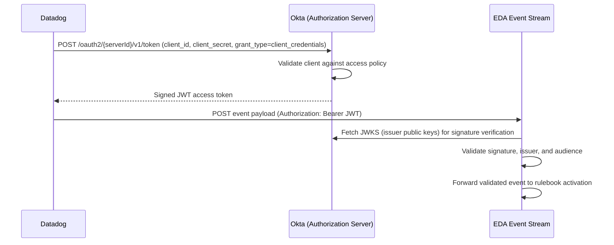

# Integrating Datadog with Event-Driven Ansible using OAuth2 JWT

<p align="center">
  
  <picture>
    <source media="(prefers-color-scheme: dark)" srcset=".attachments/arrow-dark.svg">
    
  </picture>
  
</p>

Event-Driven Ansible (EDA) event streams support several authentication methods for verifying inbound webhook traffic — Basic Authentication, Token Authentication, HMAC, OAuth2, and **OAuth2 with JWT**. Datadog's webhook integration supports OAuth2 Client Credentials, which pairs with EDA's **OAuth2 JWT Event Stream** credential type: a Machine-to-Machine (M2M) flow where Datadog authenticates to an external Identity Provider (IdP), receives a signed JSON Web Token (JWT), and presents that token as a bearer credential on every event it delivers to EDA.

This guide walks through that pattern end-to-end using **Okta** as the IdP, but the same steps apply to any OIDC-compliant provider (Microsoft Entra ID, Keycloak, Auth0, etc.) — only the specific screens/terminology change. Once the event stream and credential are created, the downstream rulebook, activation, and remediation workflow are identical to any other Datadog event stream — only the authentication method differs.

### Why choose OAuth2 JWT over Basic/Token auth

| Consideration | Basic / Token Auth | OAuth2 with JWT |
| --- | --- | --- |
| Credential lifecycle | Long-lived static secret shared between Datadog and EDA | Short-lived signed tokens issued on demand by the IdP; no long-lived shared secret in transit |
| Centralized identity/audit | No | Yes — token issuance, scopes, and revocation are managed centrally in the IdP |
| Rotation | Manual secret rotation on both sides | Automatic — tokens expire and are re-issued transparently |
| Setup complexity | Low | Higher — requires an Authorization Server, application registration, and access policy in the IdP |

## Overview of the flow

1. **Datadog** (the OAuth2 client) requests an access token from **Okta** (the Authorization Server) using its Client ID and Client Secret via the Client Credentials grant.
2. **Okta** validates the client's credentials against the configured access policy and issues a signed **JWT**.
3. **Datadog** sends its alert payload as an HTTP `POST` to the EDA **event stream** endpoint, presenting the JWT in the `Authorization: Bearer <token>` header.
4. **EDA** validates the JWT — checking the signature against Okta's published JWKS (JSON Web Key Set), and verifying the issuer and audience — before accepting the event.
5. Once validated, the event is handed to the mapped **rulebook activation**, which evaluates its rules against `event.payload` and launches a job/workflow template exactly as it would for any other event stream, e.g. [`rulebooks/datadog_event_stream.yml`](../rulebooks/datadog_event_stream.yml).



## Tech Stack

- Datadog (Agent + Monitors + Webhooks integration with OAuth2 Client Credentials authentication)
- Okta (or any OIDC-compliant Identity Provider) as the OAuth2 Authorization Server
- Ansible Automation Platform Controller
- Event-Driven Ansible Controller (OAuth2 JWT Event Stream credential type)
- Optional: ServiceNow, AWS, or whatever infrastructure the remediation playbook targets

## Phase 1: Identity Provider (Okta) configuration

The first step is configuring Okta to act as the Authorization Server for the Datadog-to-EDA M2M communication.

### 1.1 Create an OAuth2 Custom Authorization Server

While you can use Okta's `default` authorization server, creating a custom one gives you dedicated control over scopes, claims, and access policies for this integration.

1. Log in to the **Okta Admin Console**.
2. Navigate to **Security > API**.
3. On the **Authorization Servers** tab, click **Add Authorization Server**.
4. Provide the following details:
    | Field | Value |
    | --- | --- |
    | Name | `EDA Datadog Integration` |
    | Audience | `https://aap.example.com` (this value must match what EDA expects during token validation) |
    | Description | Auth server for Datadog to EDA webhook communication |
5. Click **Save**.
6. Note the **Issuer URI** (for example, `https://<your-okta-domain>/oauth2/aus<serverId>`). This value is required for both the Datadog and EDA configuration steps below.

### 1.2 Define scopes and claims (optional but recommended)

1. Within the new Authorization Server, go to the **Scopes** tab.
2. Click **Add Scope**. Create a scope such as `eda.events.write`.

### 1.3 Create an Access Policy

A policy determines who can request tokens from this Authorization Server and under what conditions.

1. Go to the **Access Policies** tab within the Authorization Server.
2. Click **Add Policy**. Name it (for example, `Allow Datadog M2M`) and assign it to **All clients**.
    - You can come back and restrict use to the application you create in 1.4
3. Click **Add Rule** on the policy. Ensure the rule allows the **Client Credentials** grant type and grants the scope(s) created in step 1.2 (`eda.events.write`).

### 1.4 Register the Datadog client application

This creates the identity Datadog will use to authenticate with Okta.

1. Navigate to **Applications > Applications**.
2. Click **Create App Integration**.
3. Select **API Services** — this specifically enables the Machine-to-Machine Client Credentials flow. Click **Next**.
4. Name the application (for example, `Datadog Webhook Client`).
5. Click **Save**.
6. On the application's **General** tab, navigate to the **General Settings** section and click Edit. Uncheck the **Proof of possession** input as DataDog does not natively support DPoP.
7. On the application's **General** tab, note the **Client ID** and **Client Secret**. You will need both for the Datadog webhook configuration in Phase 3.

## Phase 2: EDA credential and event stream setup

### 2.1 Create the OAuth2 JWT Event Stream credential

EDA needs to know how to validate the tokens issued by Okta.

1. Log in to the Ansible Automation Platform Dashboard.
2. Navigate to **Automation Decisions > Infrastructure > Credentials**.
3. Click **Create credential**.
4. Provide the following:
    | Field | Value |
    | --- | --- |
    | Name | `Okta-JWT-Validator` |
    | Organization | Select your organization, or `Default` |
    | Credential type | `OAuth2 JWT Event Stream` |
    | JWKS URL | Derived from the Issuer URL in Step 1.1<br>`https://<your-okta-domain>/oauth2/aus<serverId>/v1/keys` |
    | Audience | The Audience configured in Step 1.1 (Optional, but recommended) |
5. Click **Create credential**.

### 2.2 Create the event stream

1. From the navigation panel, select **Automation Decisions > Event Streams**.
2. Click **Create event stream**.
3. Configure the following:
    | Field | Value |
    | --- | --- |
    | Name | `Datadog-Okta-Stream` |
    | Organization | Select your organization, or `Default` |
    | Event stream type | `OAuth2 with JWT` |
    | Credentials | `Okta-JWT-Validator` (created in Step 2.1) |
    | Headers | Leave blank, or add specific headers (e.g. `Content-Type`) needed by your rulebook conditions |
    | Forward events to rulebook activation | Leave **disabled** until you've verified connectivity in Phase 4, then enable it |
4. Click **Create event stream**.
5. **Crucial step:** Upon creation, EDA generates a **POST URL** endpoint on the Details page. Copy this URL — Datadog will use it as the destination for its webhook.

## Phase 3: Datadog webhook configuration

### 3.1 Open Webhook Integrations

1. Log in to Datadog.
2. Navigate to **Integrations > Integrations** and search for **Webhooks**.
3. Open the **Webhooks** integration tile and click **New Webhook**.

### 3.2 Configure New Webhook

Populate the webhook settings using the information gathered in Phases 1 and 2:

#### 3.2.1 Auth Method

Fill in the **OAuth 2.0 Client Credentials** fields:

| Field | Value |
| --- | --- |
| Name | Okta JWT Auth |
| Access Token URL | Derived from the Issuer URL in Step 1.1<br>`https://<your-okta-domain>/oauth2/aus<serverId>/v1/token` |
| Client ID | From the Okta API Services application (Step 1.4) |
| Client Secret | From the Okta API Services application (Step 1.4) |
| Scopes | If configured in Okta (Step 1.2), enter them here (e.g. `eda.events.write`)<br>_Optional, but recommended_ |
| Audience | https://aap.example.com<br>_Optional, but recommended_ |

#### 3.2.2 Webhook

| Field | Value |
| --- | --- |
| Name | `eda_automation_okta` (used to invoke the webhook, e.g. `@webhook-eda_automation_okta`) |
| URL | The Event Stream **POST URL** endpoint from Step 2.2 |
| Auth Method | `Okta JWT Auth` |
| Payload | _See next step_ |

#### 3.2.3 Payload

Use the default payload or customize with DataDog [variables](https://docs.datadoghq.com/integrations/webhooks/#variables). This must line up with the fields your rulebook conditions expect to find under `event.payload` — for example, the same fields consumed by [`rulebooks/datadog_event_stream.yml`](../rulebooks/datadog_event_stream.yml) (`alert_title`, `hostname`, `event_link`):

```json
{
  "alert_title": "$ALERT_TITLE",
  "hostname": "$HOSTNAME",
  "event_link": "$LINK",
  "status": "$ALERT_STATUS",
  "priority": "$ALERT_PRIORITY",
  "metric": "$ALERT_METRIC"
}
```

Click **Save** to activate the webhook.

### 3.3 Reference the webhook from a Monitor

As with any Datadog webhook, add the handle (for example, `@webhook-eda_automation_okta`) to the notification message of any Monitor you want to route through the Event-Driven Ansible Event Stream:

```text
@webhook-eda_automation_okta
{{#is_alert}} Alert: {{event.title}} on {{host.name}}. {{/is_alert}}
{{#is_warning}} Warning: {{event.title}} on {{host.name}}. {{/is_warning}}
```

 > The rulebook, activation, and remediation workflow steps are unaffected by the choice of authentication method — only the event stream's credential and type change.

## Phase 4: Testing and validation

1. **Trigger Datadog:** Add the new webhook (e.g. `@webhook-eda_automation_okta`) to a test monitor in Datadog and trigger it (or use **Test Notification** if your monitor type supports it).
2. **Verify token issuance:** Check the **Okta System Log**. You should see a successful **Client Credentials flow** token issuance for the Datadog application.
3. **Verify EDA receipt:** In Ansible Automation Platform, navigate to **Automation Decisions > Event Streams** and open `Datadog-Okta-Stream`. Confirm the **Events received** counter increments and inspect the **Header**/**Body** sections to confirm the payload matches what your rulebook expects.
4. **Enable forwarding:** Once connectivity is confirmed, toggle **Forward events to rulebook activation** on the event stream so events reach your rulebook activation.
5. **Check the Rule Audit:** Navigate to **Automation Decisions > Rule Audit** to confirm actions were triggered for the incoming events.

## Troubleshooting

| Symptom | Likely cause |
| --- | --- |
| Datadog webhook shows an authentication failure | Token URL, Client ID, or Client Secret mismatched with the Okta application; verify the Client Credentials grant is enabled in the Okta Access Policy |
| EDA event stream shows no events received | The Datadog webhook URL doesn't match the event stream's POST URL, or the webhook was never attached to a monitor's notification |
| EDA rejects the event with a signature/validation error | Issuer URL or Audience configured on the `OAuth2 JWT Event Stream` credential doesn't match the Authorization Server used to issue the token |
| Token issuance succeeds in Okta but EDA still rejects the event | Confirm the Authorization Server's Audience matches the Audience configured on the EDA credential, and that any required scopes are included in the token request |

## References

- [Example Rulebook](../rulebooks/datadog_event_stream.yml)
- [Red Hat Event Stream Docs](https://docs.redhat.com/en/documentation/red_hat_ansible_automation_platform/2.5/html/using_automation_decisions/simplified-event-routing)
- [Event Stream Credential Type Source](https://github.com/ansible/eda-server/blob/62835168d7e79eec04050e3e3dbe96cdfbd861e9/src/aap_eda/api/event_stream_authentication.py#L164)
- [Datadog Webhooks integration docs](https://docs.datadoghq.com/integrations/webhooks/)
- [Okta: Implement OAuth for Okta with the Client Credentials grant](https://developer.okta.com/docs/guides/implement-grant-type/clientcreds/main/)
