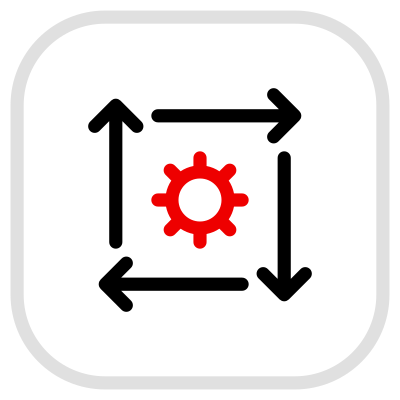
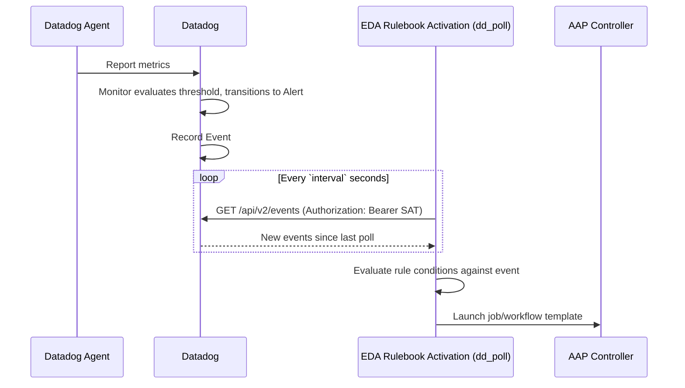
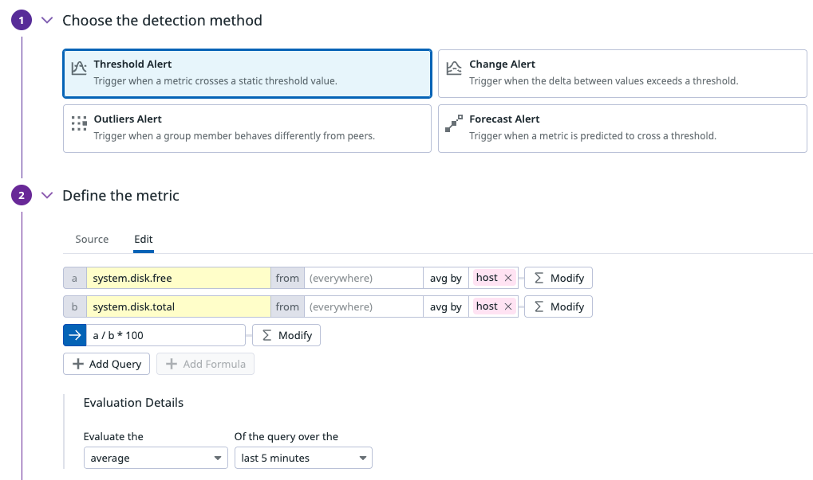
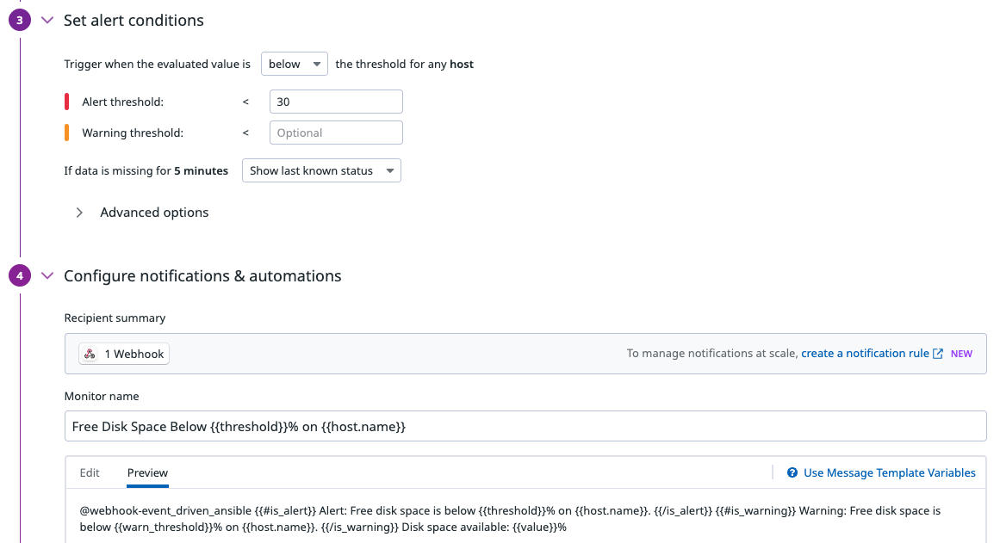
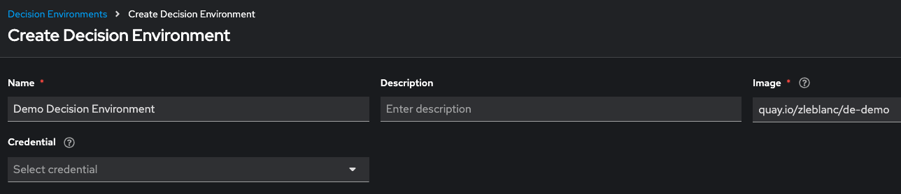

# Polling Datadog Events with Event-Driven Ansible

<p align="center">
  
  <picture>
    <source media="(prefers-color-scheme: dark)" srcset=".attachments/arrow-dark.svg">
    
  </picture>
  
</p>

The [Datadog + EDA integration](datadog_eda_integration.md) in this repo uses the **event stream** (push/webhook) pattern: **Datadog initiates the connection**, `POST`ing alerts to an AAP-managed endpoint, so AAP must be reachable *inbound* from Datadog. That pattern is the right default, but some environments don't permit inbound access to AAP at all (e.g. AAP sits behind a firewall with an outbound-only / egress-only policy, has no publicly reachable endpoint, or inbound changes require lengthy change control) — while still allowing AAP to make **outbound** calls out to the Datadog API.

This guide covers that alternative: a **polling** source plugin, `zjleblanc.eda.dd_poll`, that runs inside the rulebook activation and **initiates the connection the other way** — AAP periodically calls out to the [Datadog Events API](https://docs.datadoghq.com/api/latest/events/) to pull new events. Datadog never needs to reach AAP; AAP only needs outbound HTTPS access to Datadog. Use this pattern specifically when inbound traffic to AAP isn't allowed but AAP can reach Datadog. It's a locally-maintained, security-hardened plugin, authenticating with a Datadog **Service Access Token** instead of a static API key / Application key pair.

The worked example reuses the same **free disk space** scenario as the [event stream guide](datadog_eda_integration.md) and the [Dynatrace disk-space lab](expand_disk_space.md), so the downstream remediation workflow is identical — only how EDA learns about the alert differs.

### Source Code

- [Rulebook](../rulebooks/datadog_event_poll.yml)
- [`zjleblanc.eda` collection / `dd_poll` plugin source](../collections/zjleblanc/eda/extensions/eda/plugins/event_source/dd_poll.py)
- [Galaxy listing](https://galaxy.ansible.com/ui/repo/published/zjleblanc/eda/)

The workflow and job templates associated with the remediation are in two external repositories:
- [Configuration-as-Code](https://github.com/zjleblanc/ansible-cac/tree/main/config/aiops)
- [Ansible Playbooks](https://github.com/zjleblanc/ansible-cloud-mgmt/tree/master/playbooks)

## End-to-end flow

1. The **Datadog Agent** runs on a monitored host and continuously reports metrics/logs/traces to Datadog.
2. A **Datadog Monitor** evaluates those metrics against a threshold (for example, disk space below 30%) and transitions to an **Alert** state. Datadog automatically records this transition as an **Event** — no webhook configuration is required for the event to exist.
3. The **`dd_poll`** source plugin, running inside the EDA **rulebook activation**, is the one that initiates the connection: it calls `GET /api/v2/events` outbound against the Datadog API on an interval, authenticating with a **Service Access Token** presented as a bearer credential. Datadog never connects to AAP. The plugin only requests events newer than its last successful poll (with a small overlapping lookback window) and de-duplicates by event ID.
4. Each new event is put on the rulebook's event queue and evaluated against the rules in [`rulebooks/datadog_event_poll.yml`](../rulebooks/datadog_event_poll.yml) — conditions match directly against event fields (`event.title`, `event.hostname`, etc.), with no `event.payload` wrapper.
5. When a condition matches, the rule's action launches an AAP **job template** or **workflow template** to remediate the issue — optionally creating/updating a ServiceNow incident along the way, and closing the loop once resolved.




## Tech Stack

- Datadog (Agent + Monitors + Events API + Service Access Tokens)
- `zjleblanc.eda` Ansible collection (`dd_poll` event source plugin), published to Ansible Galaxy
- Ansible Automation Platform Controller
- Event-Driven Ansible Controller
- Optional: ServiceNow, AWS, or whatever infrastructure the remediation playbook targets

## Setup

### Install and configure the Datadog Agent

Install the [Datadog Agent](https://docs.datadoghq.com/agent/) on each host you want to monitor. Any integration the Agent supports (disk, CPU, memory, process, network, log collection, APM, etc.) can ultimately drive an EDA remediation — the Agent doesn't need any special configuration for this integration beyond what a normal Datadog check requires. This step is identical to the [event stream guide](datadog_eda_integration.md#install-and-configure-the-datadog-agent).

### Create a Datadog Service Account and Service Access Token

Datadog's current recommended authentication model for automation is a **Service Access Token (SAT)** tied to a **service account**, rather than a personal Application Key. SATs are scoped, support expiration policies, and remain valid independent of any individual user's access.

1. In Datadog, go to **Organization Settings > Service Accounts** and click **New Service Account**. Give it a descriptive name, e.g. `eda-datadog-poll`.

   

2. Open the new service account's details page, and under **Access Tokens**, click **New Token**.
3. Configure the token:

    | Field | Value |
    | --- | --- |
    | Name | `eda-dd-poll-sat` |
    | Expiration Date | Per your rotation policy — `1 year` or `Custom` recommended over `Never` |
    | Scopes | `events_read` (minimum required for this plugin; add only what you need) |

   

4. Click **Create Token** and **copy the token value immediately** — it is only shown once and starts with the `ddsat_` prefix. Store it in a secrets manager; you'll paste it into an AAP credential in the [AAP Credential](#aap-credential) step below.

> This plugin also supports the legacy v1 Events API (static `api_key` + `app_key`) for environments that haven't migrated yet, but this is **deprecated** — Datadog has marked Application Keys as a legacy authentication method. Use the SAT approach above for any new integration.

### Create a Datadog Monitor

In the Datadog portal, navigate to **Monitors > New Monitor** and choose the monitor type that matches what you want to observe (Metric, APM, Log, Process, etc.). For the disk-space example used by this repo's rulebook, create a **Metric Monitor**:

| Config | Value |
| --- | --- |
| Monitor type | Metric |
| Detection method | Threshold Alert |
| Define the Metric > Source | `avg:system.disk.free{*} by {host} / avg:system.disk.total{*} by {host} * 100` |
| Define the Metric > Evaluation Details | Evaluate the `average` of the query over the `last 5 minutes` |
| Data source scope | Filter to the host(s) or tags of interest |
| Set alert conditions > Alert threshold | `< 30` e.g. (below 30% free) |
| Configure notifications & automations > Monitor name | **Free Disk Space Below 30%** |

⚠️ **Monitor name** is important — the rulebook's condition matches on `event.title`. If you change the title, update the condition in the rulebook to match.

Unlike the event stream pattern, **no webhook or notification recipient is required here**. Datadog records an Event every time a Monitor changes state regardless of its notification configuration — `dd_poll` picks these up directly from the Events API on its next poll.




Key event fields the rulebook consumes:

| Field | Used for |
| --- | --- |
| `event.title` | Matching the rule condition (`is match("Free Disk Space Below", ...)`) |
| `event.hostname` | Throttle grouping and the `_host` extra var passed to the remediation workflow |
| `event.id` | Included in the ServiceNow incident description/comments to reference the Datadog event |

### EDA Decision Environment

Unlike the event stream pattern, this integration **requires** the `zjleblanc.eda` collection (which provides the `dd_poll` plugin and its `aiohttp` Python dependency) to be present in the decision environment used by the activation. The default/built-in AAP decision environment does **not** include it.

1. Build (or request from your platform team) a decision environment image whose `execution-environment.yml` includes:

    ```yaml
    ...
    dependencies:
      galaxy:
        collections:
          - name: zjleblanc.eda
          ...
    ```

2. Push the resulting image to your container registry, then register it in AAP: navigate to **Automation Decisions > Infrastructure > Decision Environments** and click **Create Decision Environment**, pointing **Image** at your custom image.

   

> This repo doesn't own the decision environment build — it assumes `zjleblanc.eda` has already been published to Galaxy and is simply listed as a collection dependency in whichever decision environment definition your platform team maintains.

### EDA Project

Point an AAP **Project** at this git repository (or your fork) so the rulebook is available to activations.

| Config | Value |
| --- | --- |
| Name | EDA Demos Project |
| SCM type | Git |
| SCM URL | https://github.com/zjleblanc/ansible-eda-demos.git |
| Credential | _Not required for public repo_ |
| Verify SSL | ✅ |

### AAP Credential

The Datadog Service Access Token must reach the `dd_poll` plugin as the `DD_BEARER_TOKEN` environment variable on the rulebook activation — **never** paste it directly into the rulebook or a plugin argument. The clean way to do this in AAP is a custom **Credential Type** with an environment-variable injector, attached to the activation.

1. Navigate to **Automation Decisions > Infrastructure > Credential Types** and click **Create credential type**.
2. Configure the **Input configuration**:

    ```yaml
    fields:
      - id: dd_bearer_token
        type: string
        label: Datadog Service Access Token
        secret: true
    required:
      - dd_bearer_token
    ```

3. Configure the **Injector configuration**:

    ```yaml
    env:
      DD_BEARER_TOKEN: '{{ dd_bearer_token }}'
    ```

4. Save the credential type (e.g. name it `Datadog SAT`), then navigate to **Credentials > Create credential**, select the `Datadog SAT` type, and paste the SAT value created in the [Datadog Service Account](#create-a-datadog-service-account-and-service-access-token) step.

   

5. This credential will be attached directly to the rulebook activation in the next step — AAP injects `DD_BEARER_TOKEN` into the activation's running process, where `dd_poll` reads it.

### EDA Rulebook Activation

Navigate to **Rulebook Activations > Create rulebook activation**:

| Config | Value |
| --- | --- |
| Name | Datadog Event Poll |
| Project | EDA Demos Project |
| Rulebook | `datadog_event_poll.yml` |
| Decision environment | The custom DE from the [EDA Decision Environment](#eda-decision-environment) step above |
| Credentials | `Datadog SAT` credential created above |
| Controller token | Token |
| Restart policy | On failure |
| Rulebook activation enabled? | _Checked_ |

Note there is **no Event Streams mapping** step here, unlike [`datadog_event_stream.yml`](../rulebooks/datadog_event_stream.yml) — the `dd_poll` source plugin itself establishes the connection to Datadog, so the `sources` entry in the rulebook is used as-is, not swapped out at activation time.


### AAP Resources

The rulebook launches the same downstream automation described in the [disk space remediation lab](expand_disk_space.md#the-workflow) — a workflow with steps for creating a ServiceNow incident, resizing storage, and updating the incident. Reuse that workflow (`EDA // Remediation Workflow // Disk Space`) and its credentials/inventory rather than duplicating them; only the **event source** differs between the event-stream and polling demos, not the remediation.

## The rulebook explained

[`rulebooks/datadog_event_poll.yml`](../rulebooks/datadog_event_poll.yml):

```1:22:rulebooks/datadog_event_poll.yml
### Polling pattern -- requires the zjleblanc.eda collection in the Decision Environment ###
### See docs/datadog_eda_polling_integration.md for full setup instructions ###
---
- name: Poll DataDog Events API for Event-Driven Ansible
  hosts: all

  sources:
    # Unlike the event-stream rulebooks in this repo, this source is NOT a
    # placeholder -- the plugin itself polls the Datadog Events API from
    # within the rulebook activation process. No Event Stream mapping is
    # needed for this pattern.
    #
    # Authentication: the Datadog bearer token (a Service Access Token) is
    # read from the DD_BEARER_TOKEN environment variable, which should be
    # injected into the rulebook activation from an AAP credential -- it is
    # intentionally not set as a plugin argument here. See
    # docs/datadog_eda_polling_integration.md for how to configure this on
    # the activation.
    - name: DataDog Event Source
      zjleblanc.eda.dd_poll:
        interval: 15
        lookback_minutes: 5
```

Unlike the event stream rulebook, the `sources` entry here is **not** a placeholder — `zjleblanc.eda.dd_poll` is a real, running source plugin for both local testing and AAP activation. The Datadog bearer token is deliberately absent from the plugin arguments; it's read from the `DD_BEARER_TOKEN` environment variable injected by the AAP credential configured on the activation.

```24:46:rulebooks/datadog_event_poll.yml
  rules:
    # Commands to generate mock disk consumption
    # (linux)    fallocate -l 4G dummy.img
    # (windows)  $file = [System.IO.File]::Create("C:\users\ec2-user\dummylarge.txt"); $file.SetLength(10GB); $file.Close();
    - name: Launch Free Disk Space Remediation
      condition: event.title is match("Free Disk Space Below", ignorecase=true)
      throttle:
        once_within: 30 minutes
        group_by_attributes:
          - event.hostname
      action:
        run_workflow_template:
          name: EDA // Remediation Workflow // Disk Space
          organization: Autodotes
          job_args:
            extra_vars:
              _host: "{{ event.hostname }}"
              _aws_region: "us-east-2"
              inc_short_description: "{{ event.title }} [{{ event.hostname }}]"
              inc_description: "Auto-generated event by Ansible for DataDog event {{ event.id }}"
              inc_other:
                comments: >
                  [code] <p>Datadog event ID: {{ event.id }}</p> [/code]
```

**Launch Free Disk Space Remediation** matches any event whose title contains "Free Disk Space Below" (case-insensitive). It's **throttled** to fire at most once every 30 minutes per hostname — important because a Monitor re-evaluating while still in an alert state can generate repeated events, and you don't want to launch the remediation workflow on every one. Note the field names: `event.title` and `event.hostname` are read directly off the event root (no `event.payload` wrapper), because `dd_poll` emits the flattened Datadog event object directly onto the queue.

```48:52:rulebooks/datadog_event_poll.yml
    - name: Catch 'em All
      condition: event.id is defined
      action:
        debug:
          msg: "{{ event }}"
```

**Catch 'em All** matches every polled event and dumps it via `debug`. It's useful while first wiring up the activation — enable it to confirm events are flowing (and see the full field set an event carries) before layering on real remediation rules, then disable or remove it once you're done.

## Polling vs Event Stream

Both patterns are available in this repo and can be run side by side against the same Datadog organization — pick based on your network and operational constraints:

| Consideration | Event Stream ([`datadog_event_stream.yml`](../rulebooks/datadog_event_stream.yml)) | Polling ([`datadog_event_poll.yml`](../rulebooks/datadog_event_poll.yml)) |
| --- | --- | --- |
| Direction | **Push** — Datadog initiates: Datadog → AAP (inbound to AAP) | **Pull** — AAP initiates: AAP → Datadog (outbound from AAP) |
| Network requirement | AAP must expose a reachable inbound endpoint to Datadog | AAP only needs outbound HTTPS access to the Datadog API; no inbound access to AAP required |
| Decision environment | Default/built-in DE is sufficient | Requires a custom DE with `zjleblanc.eda` installed |
| Event latency | Near-instant (push) | Up to one `interval` (poll) |
| Event scope | Only what you wire into the webhook payload/Monitor notification | Any Datadog Event, including ones with no notification configured |
| Authentication | Event stream credential (Basic/Token/HMAC/OAuth2) on the Datadog webhook side | Datadog Service Access Token on the AAP activation side |
| Setup complexity | Lower (no custom DE) | Higher (custom DE, SAT, custom credential type) |

See [`docs/datadog_eda_integration.md`](datadog_eda_integration.md) for the event stream walkthrough, and [`docs/datadog_eda_integration_oauth.md`](datadog_eda_integration_oauth.md) for an OAuth2/JWT-secured variant of that pattern.

## Triggering a test alert

To exercise the disk-space example end-to-end, SSH to a monitored host and fill up disk space:

```bash
# linux
fallocate -l 4G dummy.img
```

```powershell
# windows
$file = [System.IO.File]::Create("C:\users\ec2-user\dummylarge.txt")
$file.SetLength(10GB)
$file.Close()
```

The Datadog Agent will pick up the drop in free disk space on its next reporting interval, the Monitor will transition to Alert once its evaluation window confirms the threshold breach, and Datadog will record the Event — at which point `dd_poll`'s next poll (within `interval` seconds) should pick it up and launch the remediation workflow.

## Troubleshooting

| Symptom | Likely cause |
| --- | --- |
| Activation fails to start with an import error for `aiohttp` or `zjleblanc.eda` | The decision environment doesn't have the `zjleblanc.eda` collection (and its `aiohttp` dependency) installed; rebuild the DE and confirm the collection appears in `ansible-galaxy collection list` inside the image |
| Activation log shows `dd_poll requires either a bearer token...` | The `Datadog SAT` credential isn't attached to the activation, or its injector doesn't set `DD_BEARER_TOKEN` — recheck the [AAP Credential](#aap-credential) configuration |
| Datadog API calls return `403` | The Service Access Token's scopes don't include `events_read` — edit the token's scopes (or create a new one) in Datadog |
| No events ever appear, even with `Catch 'em All` enabled | Confirm the Monitor actually transitioned to Alert in Datadog's own event stream UI; also confirm the activation is actually running (not restarting on a crash loop) |
| Events appear late | Increase `lookback_minutes` slightly, or decrease `interval` for faster polling (at the cost of more API calls) |
| Duplicate workflow launches for the same alert | Confirm the `throttle` block is present on the rule, and that `group_by_attributes` matches a stable field (`event.hostname`) |

## References

- [Rulebook: `rulebooks/datadog_event_poll.yml`](../rulebooks/datadog_event_poll.yml)
- [Plugin source: `zjleblanc.eda.dd_poll`](../collections/zjleblanc/eda/extensions/eda/plugins/event_source/dd_poll.py)
- [Event stream alternative: `docs/datadog_eda_integration.md`](datadog_eda_integration.md)
- [Datadog Events API docs](https://docs.datadoghq.com/api/latest/events/)
- [Datadog Service Access Tokens](https://docs.datadoghq.com/account_management/service-access-tokens/)
- [Datadog blog: Modernize Datadog API authentication with scoped credentials](https://www.datadoghq.com/blog/datadog-api-authentication/)
