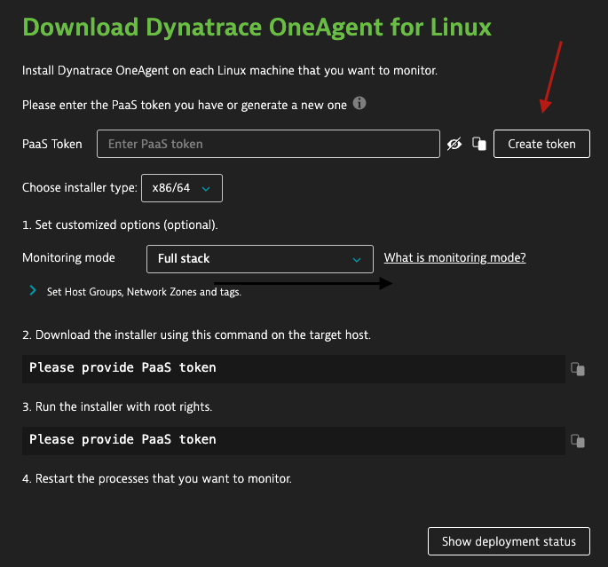
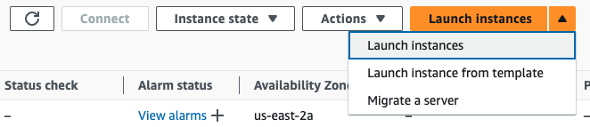
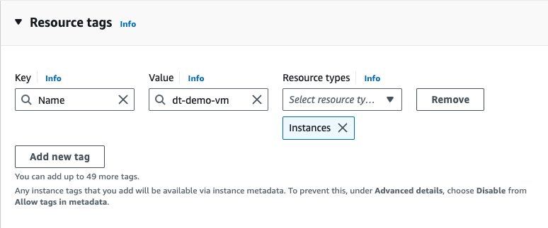
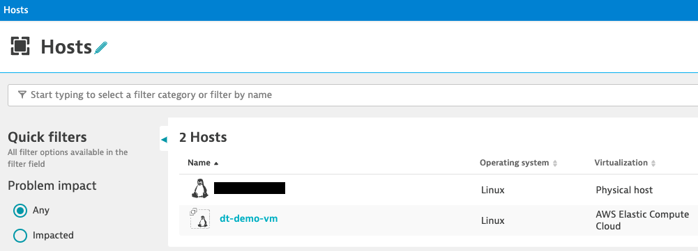
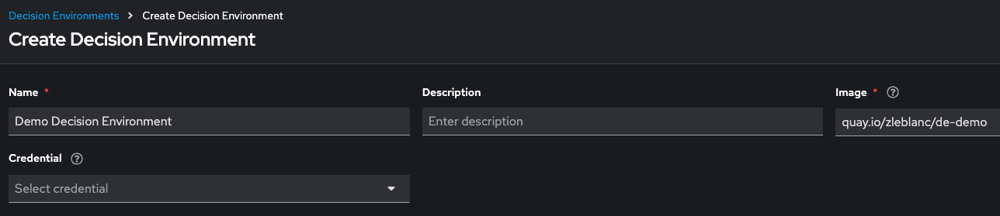
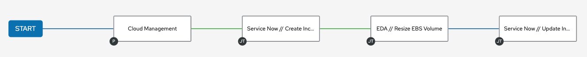
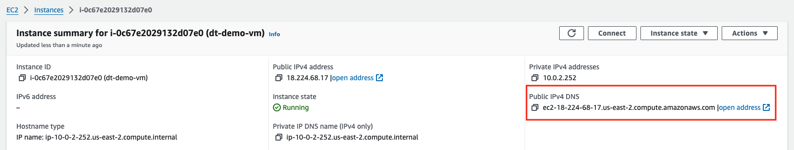

# Automated Remediation: Expand Disk Space

In this demo, you will see how Event-Driven Ansible integrates with observability solutions to deliver automatic remediation of issues and creates an audit trail via ticket management tools.

## Tech Stack

- Dynatrace
- Service Now
- Ansible Automation Platform Controller
- Event-Driven Ansible Controller
- AWS (a single EC2 instance)

## Setup

### Generate Dynatrace PaaS Token

Dynatrace is an agent-based solution. For this demo, I leverage a launch template in AWS to quickly provision EC2 instances which download and install the OneAgent on first boot to make this a repeatable demo. The commands included in the script will require a token which you can generate in the Dynatrace portal by searching for "Deploy OneAgent" and selecting the Linux option. There will be a button **Create Token** for generating a PaaS token.



### Create EC2 Launch Template

AWS Housekeeping
-  Create an AWS keypair for the machine you will use to conduct this demo. To simulate a "full disk", you will want to be able to quickly SSH and run a command. 
-  Create a VPC with a public subnet - keep the architecture simple
-  Ensure the Security Group associated with your public subnet allows
   -  SSH traffic (TCP/22)
   -  HTTPS traffic (TCP/443)

Now you can navigate to EC2 -> Instances -> Launch Templates -> Create Launch Template

Below are the options to set in the Launch Template form

| Option | Value | Note |
| --- | --- | --- |
| Amazon Machine Image | Choose from Quick Start -> Red Hat | Red Hat Enterprise Linux 9 (HVM) |
| Instance Type | t2.micro | Free tier eligible |
| Key Pair | Select your key pair created in housekeeping | This will make SSH-ing easy |
| Network Settings > Subnet | Select your **public** subnet | |
| Network Settings > Firewall | Select your security group with **allow SSH** | In Common security groups dropdown |
| Network Settings > Advanced Network Configuration > Auto-assign Public IP | Enable | |
| Storage | _Leave defaults_ | |
| Resource tags | _Optional tags to apply to demo vms_ | |
| Advanced details > Metadata accessible | Enable | Required for userdata script |
| Advanced details > Allow tags in metadata | Enable | Required for userdata script |
| Advanced details > User data | Paste [script](.attachments/dt_oneagent_userdata.sh) and replace tokens | _See examples below_ |

```yaml
# Example token values:
# make sure to use the "live" subdomain, not "apps"
DT_HOST: <instance>.live.dynatrace.com
DT_API_TOKEN: dt0c01...
```

Now you can **Create the Launch Template**

### Create EC2 Instance

Now we need to create an EC2 instance using the launch template. The benefit of a template is you only have to create it once, then you can spin up demo VMs with Dynatrace monitoring in minutes. 

Navigate to Instances > Launch Instances ^ > Launch instance from template



Select your launch template from the previous step. Scroll down to Resource tags and click **Add new tag** - provide a Name tag.



Now you can **Launch Instance** and take a break. Spinning up the VM, running the userdata script which downloads/installs OneAgent, and rebooting takes a handful of minutes to complete. The process is successful when you see a Host in the Dynatrace Hosts View with the name you provided in the Resource tags.



### Dynatrace Metric Alert

For this demo, we are going to create a Metric Alert to raise a Problem when Free Disk Space % drops below 30. In the Dynatrace Portal, navigate to (or search) Settings > Anomaly Detection > Metric events and click **Add Metric Event**. Below are the configurations I use:

| Config | Value |
| --- | --- |
| Summary | Free disk space drops below threshold of 30% |
| Query definition > Type | Metric key |
| Query definition > Metric key | Disk available % |
| Query definition > Aggregation | Minimum |
| Advanced query definition | _Leave defaults_ |
| Advanced dimensions definition > Dimension key of entity type | Host |
| Add entity filter | _None_ |
| Add dimension filter | _None_ |
| Monitoring strategy > Model type | Static threshold |
| Monitoring strategy > Threshold | 30 |
| Monitoring strategy > Threshold input unit | percent |
| Monitoring strategy > Alert on missing data | _Unchecked_ |
| Monitoring strategy > Alert condition | Alert if metric is below |
| Monitoring strategy > Advanced model properties > Violating samples | 3 |
| Monitoring strategy > Advanced model properties > Sliding window | 5 |
| Monitoring strategy > Advanced model properties > Dealerting samples | 5 |
| Event template > Title | Free Disk Space Below 30% |
| Event template > Description | The {metricname} value was {alert_condition} normal behavior. |
| Event template > Event type | Custom alert |

⚠️ **Event template > Title** is important - the rulebook used will key off of this value. If you modify in the metric alert, then be sure to modify the condition in your rulebook.

### EDA Decision Environment

To integrate with Dynatrace, you will need a decision environment with the certified Dynatrace EDA collection. Two options:
1. Create a custom decision environment using ansible-builder -> [example definition file](https://gitlab.com/zjleblanc/ansible-ee-builder/-/blob/master/definitions/de-default.yml?ref_type=heads)
1. Use mine from quay -> [de-demo](https://quay.io/repository/zleblanc/de-demo?tab=info)

To use the decision environment, we will need to create the resource definition in our EDA Controller. Navigate to Decision Environments and click **Create Decision Environment**. If you are using my image hosted in quay, then you will not need to specify a credential (it's publicly available). If you published your custom image to a private image repository, then you will need to provide a credential for authentication. You can create a Credential in the Access > Credentials selection and you will want to use the **Container Registry** type for this purpose.



### EDA Project

You will need to setup a git repository with a rulebook written to consume Dynatrace problems. You can use my repository or fork it for your own use. The rulebook can be found [here](https://github.com/zjleblanc/ansible-eda-demos/blob/master/rulebooks/dynatrace_problems.yml). Recall that the condition checking **event.title** needs to match what you set for the **Metric event > Event title**.

Navigate to Projects and click **Create Project**

| Config | Value |
| --- | --- |
| Name | EDA Demos Project |
| Name | Project for demos of Dynatrace + Event-Driven Ansible |
| SCM type | Git |
| SCM URL | https://github.com/zjleblanc/ansible-eda-demos.git |
| Credential | _Not required for public repo_ |
| Verify SSL | _Checked_ |

### EDA Rulebook Activation

You will need to setup a rulebook activation to run your rulebook and listen for Dynatrace Problems. Navigate to Rulebook Activations and click **Create rulebook activation**

| Config | Value |
| --- | --- |
| Name | Dynatrace Problems |
| Description | Rulebook activations for consuming Dynatrace Problems |
| Project | EDA Demos Project |
| Rulebook | dynatrace_problems.yml |
| Decision environment | Demo Decision Environment |
| Controller token | Token |
| Restart policy | On failure |
| Rulebook activation enabled? | _Checked_ |
| Variables | **_See below_** |

Variables example:
```yaml
DYNATRACE_HOST: https://<instance>.live.dynatrace.com
DYNATRACE_API_TOKEN: dt0c01...
DYNATRACE_PROBLEM_VIEW: ui/apps/dynatrace.classic.problems/#problems/problemdetails;gtf=yesterday;gf=all;
```

### AAP Resources

#### ServiceNow Credential

Based on a custom credential type with configuration details [here](https://docs.autodotes.com/Credential%20Types/service_now/).

| Config | Value |
| --- | --- |
| Name | Service Now (instance_name) |
| Credential Type | Service Now Credential |
| ServiceNow Host | https://abc12345.service-now.com/ |
| ServiceNow User | ansible |
| ServiceNow User's Password | aut0m4t3s |

#### AWS Credential

Based on the built-in credential type **Amazon Web Services**. This will be used for `amazon.aws.*` modules and the dynamic inventory for EC2 instances.

| Config | Value |
| ---| --- |
| Name | AWS Sandbox Credential |
| Access Key | AK*** |
| Credential Type | ********* |

#### AWS Inventory

Create a new Inventory, mine is called **Cloud Inventory**. In this inventory, we are going to define a dynamic inventory source in the **Sources** tab. Navigate to Cloud Inventory > Sources and click Add.

| Config | Value |
| ---| --- |
| Name | AWS EC2 Instances |
| Execution Environment | _must have amazon.aws collection_ |
| Source | Amazon EC2 |
| Credential | _the one you created above_ |
| Update options > Overwrite | _Checked_ |
| Update options > Overwrite variables | _Unchecked_ |
| Update options > Update on launch | _Checked_ |
| Source variables | **_See below_** |

Source variables example:
```yaml
---
aws_region: us-east-1
hostnames:
  # important for this demo:
  # it will match the limit passed from the rulebook via {{ _host }}
  - tag:Name
keyed_groups:
  - prefix: platform
    key: platform
compose:
  # important for this demo:
  # it will leverage the public ip for ssh instead of the hostname
  ansible_host: public_ip_address
```

#### The Workflow



The workflow has four nodes:
| | Node | Type | Playbook | Credentials |
| --- | --- | --- | --- | --- |
| 1 | Cloud Management | Project Sync | _Repo contains all listed below_ | _SCM Credential if private_ |
| 2 | Create Incident | Job Template | [create_incident.yml](https://github.com/zjleblanc/ansible-cloud-mgmt/blob/master/playbooks/snow/create_incident.yml) | `Service Now Credential` |
| 3 | Resize EBS Volume | Job Template | [add_disk_space.yml](https://github.com/zjleblanc/ansible-cloud-mgmt/blob/master/playbooks/aws/add_disk_space.yml) | `Service Now Credential` `AWS Credential` `Machine Credential` |
| 4 | Update Incident | Job Template | [update_incident.yml](https://github.com/zjleblanc/ansible-cloud-mgmt/blob/master/playbooks/snow/update_incident.yml) | `Service Now Credential` |

The name of the workflow can be customized, but you must update the rulebook to reflect the change. The `run_workflow_template` action `name` parameter will determine what workflow template is launched when the conditions are met.

The execution environment used for each of these steps has two main collection requirements:
- servicenow.itsm
- amazon.aws

You can leverage my default execution environment [ee-default](https://quay.io/repository/zleblanc/ee-default) or roll your own. An example definition file can be found [here](https://gitlab.com/zjleblanc/ansible-ee-builder/-/blob/master/definitions/ee-default.yml?ref_type=heads).

### Triggering a Problem

The fun part! To fill up your disk space and initiate the demo, you will want to SSH to your EC2 instance. I go to the EC2 instance details view and copy the public IP address.



In your terminal of choice, run the following commands:
```bash
# from the host which you created your key pair
# accept the host key
ssh ec2-user@<copied-public-ip>

# to start, the t2.micro will be using ~3/9.2G
df -h | grep -E /$

# create a dummy file
# allocating 4G will put us at ~7/9.2G or 76%
fallocate -l 4G dummy.txt

# ensure disk usage > 70%
df -h | grep -E /$
```

Now you should be able to observe the end-to-end automated remediation process. Dynatrace will take time to generate a problem because it evaluates metrics in a sliding window. EDA will (near) instantly pickup the problem and start remediating. Once remediation is complete, Dynatrace will have a delay in auto-closing the problem while it confirms the metric has returned to an acceptable level. 